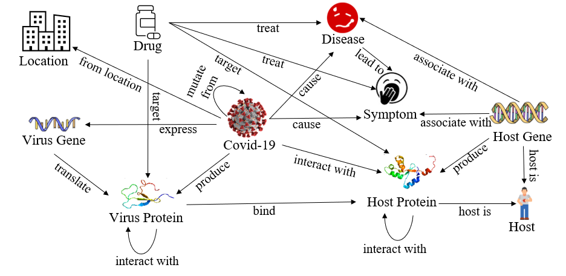
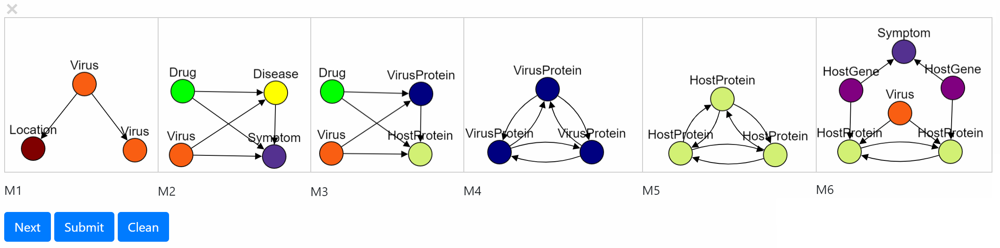

# M-Cypher: A GQL Framework Supporting Motifs
## Demonstrated by Covid-19 Knowledge Graph Analysis
This repository contains codes and data used in [M-Cypher: A GQL Framwork Supporting Motifs], which is built on Cypher to support motif-related queries for mining knowledge graphs. 

* To express a motif-related operation that is difficult to express declaratively with Cypher.
	* To provide access to motif-related functionality that is not available in Cypher.
		* For example, subgraph matching and motif connectivity.
	* To provide uniform interface to the state-of-the-art motif-related algorithms.
		* For example, motif-based graph clustering, motif-based node ranking and motif-based link prediction, which is proved better effectiveness than the ordinary edge-based solutions in many cases.
* To provide user-friendly input and output, when fullfilling standard GQL protocals.
* To embed advanced features into the query, e.g., motif adjacency matrix .

## Datasets
The code takes the **edge list** of the graph. Every row indicates an edge between two nodes separated by a comma. The datasets used in the paper are included in the  `data/` directory.
#### nodes
`nodeID,nodeLabelID,nodeName`
#### edges
`nodeID1,nodeID2,edgeLabelID`
#### labels
Labels for nodes `nodeLabelID:nodeLabel` and edges `edgeLabelID:edgeLabel`
<p align="center">
  
</p>

## Usage 

### Open `codes/webpage/mcypher.html` for local view.
* Declarative functionalities:
	* Motif counting (see Q1);
	* Motif instance enumerating (a.k.a isomorphic subgraph detection, see Q2);
	* Motif-paths finding (e.g., nodes reachable by triangle connectivities, see Q3);
	* Motif-components finding (e.g., k-cliques);
* Embedded API functionalities:
	* Motif Page Rank for better node ranking;
	* Motif conductance for better graph clustering;	
	* Motif Discovery;
	* Motif adjacency matrix calculation;
	* Motif feature vectors for better link prediction.

### Use cases
In the following query examples, we demonstrate several use cases by motif M, which is predefined by the user in the GUI.
#### Q1: What is the significance of motif pattern M?
* cypher:	`MATCH p=(t1:Location)<-[r1:from_location]-(s:Virus)-[r2:mutate_from]->(t2:Virus) RETURN COUNT (p)`
* m-cypher:	`MATCH (m:M) RETURN COUNT (m)`
* What if M is a large and xomplex motif? 
	* Almost impossible to describe M by path pattern queries in cypher! 
	* Even so, over-countering occurs in Cypher!
#### Q2: What are the instances of motif pattern M?
* cypher:	`MATCH (t1:Location)<-[r1:from_location]-(s:Virus)-[r2:mutate_from]->(t2:Virus) RETURN s,t1,t2`
* m-cypher:	`MATCH (m:M) RETURN m`
* Same problems exists as Q1!
#### Q3: How virus mutates when spreading from Hong Kong?
* cypher:	NA
* m-cypher:	`MATCH (s:Location)-[m:M*]->(t:Location) WHERE s.name = "Hong Kong" RETURN t.name`
#### Q4: What are the significant motifs about Covid-19 virus?
* cypher:	NA
* m-cypher:	
`MATCH (s:Virus) WHERE s.name="SARS-CoV-2"
CALL MDIS(s,4,["Drug","Virus","Disease","Symptom"])
YIELD permutation AS motif, frequency
RETURN motif, frequency ORDER BY frequency DESC`
#### Q5: What is the motif feature vector for the possible missing link (Drug, Covid-19)?
* cypher:	NA
* m-cypher:	
```
MATCH (s:Virus) 
WHERE s.name="SARS-CoV-2" 
MATCH (t:Drug)
CALL MFV(s,t,[M1,M2]) 
YIELD s, t, vm 
RETURN t.name, vm
```
#### Q5: What are the potential drugs for Covid-19 by MPPR ranking?
* cypher:	NA
* m-cypher:	
```
MATCH (s:Virus) WHERE s.name="SARS-CoV-2"
CALL MPPR(s,[M2,M3,M4,M5],10000,0.85)
YIELD node, MPPR_score 
WITH labels(node) AS ln, 
node.name AS Drug_name, MPPR_score
WHERE ln = "Drug" AND score > 0
RETURN Drug_name, MPPR_score
ORDER BY MPPR_score DESC
```

<p align="center">
  
</p>

## Dependencies
### Neo4j 
* Install [neo4j](https://neo4j.com/download-center/).
* Put data into `<neo4j-home>/import`. 
* Import Covid-19 knowledge graph data into neo4j.
* Put the combiled M-Cypher plugin into `<neo4j-home>/plugin`.
