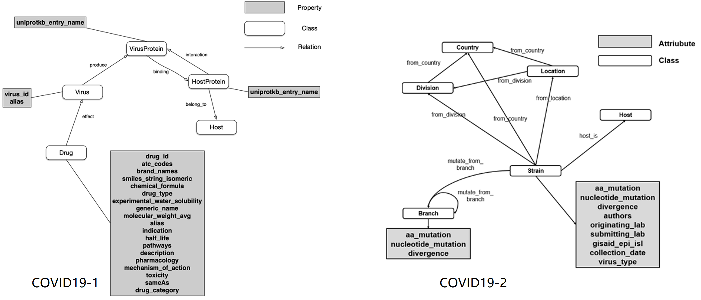
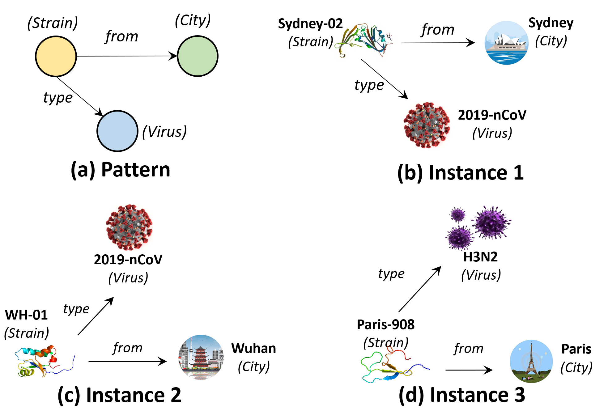

# M-Cypher: A GQL Supporting Motifs
This repository contains codes and datasets used in [M-Cypher: A GQL Supporting Motifs], which is built on Cypher to support motif-related queries. 

* To express a motif-related operation that is difficult to express declaratively with Cypher.
	* To provide access to motif-related functionality that is not available in Cypher.
		* For example, subgraph matching and motif connectivity.
	* To provide uniform interface to third party applications w.r.t. motifs.
		* For example, proved better effectiveness for clustering, node ranking and link prediction.
		```
		MATCH (A) WITH A, size((A)--()) as degree WHERE degree>4000
		CALL algo.pageRank.stream(null, null, {iterations:20, dampingFactor:0.85, sourceNodes: [A]}) YIELD nodeId, score
		RETURN algo.asNode(nodeId) AS page,score ORDER BY score DESC
		```
* To provide user-friendly input and output.
* To fullfill standard GQL protocals in theory.
* To embed advanced features into the query, e.g., motif adjacency matrix, proximity (distance) matrix w.r.t. motifs.

## Datasets
The code takes the **edge list** of the graph. Every row indicates an edge between two nodes separated by a comma. The datasets used in the paper are included in the  `data/` directory.
#### nodes
`nodeID,nodeLabelID,nodeName`
#### edges
`nodeID1,nodeID2,edgeLabelID`
#### labels
Labels for nodes `nodeLabelID:nodeLabel` and edges `edgeLabelID:edgeLabel`
<p align="center">
  
</p>

## Usage 

### Open `codes/webpage/mcypher.html` for local view.

### Components to be added:
* Motif input [Matin];
* Output visulization [Matin];
* M-Cypher parser [Xiaodong];
* 4-page paper [Xiaodong];
* Declarative functionalities [Xiaodong]:
	* Motif counting (see Q1);
	* Motif instance enumerating (a.k.a isomorphic subgraph detection, see Q2);
	* Motif-paths finding (e.g., nodes reachable by triangle connectivities, see Q3);
	* Motif-components finding (e.g., k-cliques);
* Embedded API functionalities [Matin and Xiaodong]:
	* Motif Page Rank for better node ranking;
	* Motif conductance for better graph clustering;	
	* Motif Discovery;
	* Motif adjacency matrix calculation;
	* Motif feature vectors for better link prediction.

### Use cases
In the following query examples, we demonstrate three use cases (Q1, Q2 and Q3) by motif M, which is predefined by the user in the GUI.
#### Q1: What is the significance of motif pattern M?
* cypher:	`MATCH p=(:Country)<-[:from_country]-(:Strain)-[:mutate_from_branch]->(:Branch) RETURN COUNT (p)`
* m-cypher:	`MATCH (m:M) RETURN COUNT (m)`
* What if M is a large motif? 
	* Almost impossible to describe M by path pattern queries in cypher! 
	* Even so, there will be many duplicates!
#### Q2: What are the instances of motif pattern M?
* cypher:	`MATCH (a:Location)<-[:from_location]-(b:Strain)-[:mutate_from_branch]->(c:Branch) RETURN a,b,c`
* m-cypher:	`MATCH (m:M) RETURN m`
* Same problems exists as Q1!
#### Q3: How virus mutates when spreading from Location a to Location b?
* cypher:	NA
* m-cypher:	`MATCH (a:Location{name:a})-[m:M*]->(b:Location{name:b})`

<p align="center">
  
</p>

## Dependencies
### Neo4j 
* Install [neo4j-desktop](https://neo4j.com/developer/neo4j-desktop/).
* Put data into `<neo4j-home>/import`. 
For example, `C:/Users/<user>/.Neo4jDesktop/neo4jDatabases/<database>/installation-<version>/import` in windows.
* Import COVID19 data into neo4j.
```
#put 'nodes' and 'edges' in '<neo4j-home>/import' beforehand
LOAD CSV FROM 'file:///nodes' AS line
FOREACH ( ignoreMe in CASE WHEN line[1]='0' THEN [1] ELSE [] END | CREATE (:Host {id:toInteger(line[0]),label:line[2]}))

LOAD CSV FROM 'file:///nodes' AS line
FOREACH ( ignoreMe in CASE WHEN line[1]='1' THEN [1] ELSE [] END | CREATE (:Virus {id:toInteger(line[0]),label:line[2]}))

LOAD CSV FROM 'file:///nodes' AS line
FOREACH ( ignoreMe in CASE WHEN line[1]='2' THEN [1] ELSE [] END | CREATE (:VirusProtein {id:toInteger(line[0]),label:line[2]}))

LOAD CSV FROM 'file:///nodes' AS line
FOREACH ( ignoreMe in CASE WHEN line[1]='3' THEN [1] ELSE [] END | CREATE (:HostProtein {id:toInteger(line[0]),label:line[2]}))

LOAD CSV FROM 'file:///nodes' AS line
FOREACH ( ignoreMe in CASE WHEN line[1]='4' THEN [1] ELSE [] END | CREATE (:Drug {id:toInteger(line[0]),label:line[2]}))

LOAD CSV FROM 'file:///edges' AS line
MATCH (n:Drug {id:toInteger(line[0])}), (m:Virus{id:toInteger(line[1])})
FOREACH ( ignoreMe in CASE WHEN line[2]='0' THEN [1] ELSE [] END | MERGE (n)-[:Effect]->(m))

LOAD CSV FROM 'file:///edges' AS line
MATCH (n:HostProtein {id:toInteger(line[0])}), (m:VirusProtein{id:toInteger(line[1])})
FOREACH ( ignoreMe in CASE WHEN line[2]='1' THEN [1] ELSE [] END | MERGE (n)-[:Interact]->(m))

LOAD CSV FROM 'file:///edges' AS line
MATCH (n:VirusProtein {id:toInteger(line[0])}), (m:HostProtein{id:toInteger(line[1])})
FOREACH ( ignoreMe in CASE WHEN line[2]='2' THEN [1] ELSE [] END | MERGE (n)-[:Bind]->(m))

LOAD CSV FROM 'file:///edges' AS line
MATCH (n:HostProtein {id:toInteger(line[0])}), (m:Host{id:toInteger(line[1])})
FOREACH ( ignoreMe in CASE WHEN line[2]='3' THEN [1] ELSE [] END | MERGE (n)-[:Belong_to]->(m))

LOAD CSV FROM 'file:///edges' AS line
MATCH (n:Virus {id:toInteger(line[0])}), (m:VirusProtein{id:toInteger(line[1])})
FOREACH ( ignoreMe in CASE WHEN line[2]='4' THEN [1] ELSE [] END | MERGE (n)-[:Produce]->(m))
```
### MC-Explorer 
#### [Motif-clique explorer system](http://motif.cs.hku.hk/)
#### [Format of graph for MC-explorer](http://motif.cs.hku.hk/file/readme.txt)
#### Codes 
* See `codes/mc-explorer`.
* About motif input:
see`codes/mc-explorer/platform/WebContent/js/graphM.js`, `codes/mc-explorer/platform/WebContent/js/utilities.js`
and `codes/mc-explorer/platform/WebContent/js/graphResult.js`.
* About graph visualization: [cytoscape](https://cytoscape.org/).

#### [COVID19 VLDB demo video](https://www.dropbox.com/s/xhpczwsv7m4cut1/covid_19_vldb_demo_%20compression.mp4?dl=0). 
#### [COVID19 datasource](https://mp.weixin.qq.com/s/eHbkrMtYpg-oEmWS92970w). Chinese version only.


