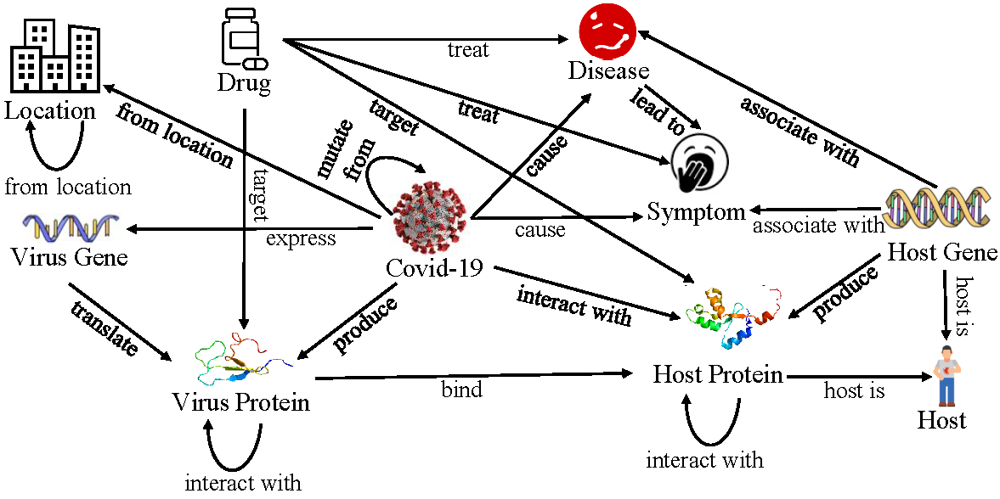
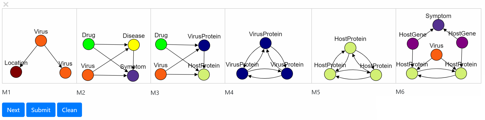

# M-Cypher: A GQL Framework Supporting Motifs
## Demonstrated by Covid-19 Knowledge Graph Analysis
This repository contains codes and data used in [M-Cypher: A GQL Framwork Supporting Motifs], which is built on Cypher to support motif-related queries for mining knowledge graphs. 

Cilick [here](https://drive.google.com/file/d/1bLzy970d6ELnnzLLmrelEHuiXOFXH9Lm/view?usp=sharing) for the video introduction!

* To express a motif-related operation that is difficult to express declaratively with Cypher.
	* To provide access to motif-related functionality that is not available in Cypher.
	* To provide uniform interface to the state-of-the-art motif-related algorithms.
* To provide user-friendly input and output, when fullfilling standard GQL protocals.
* To embed advanced features into the query.

## Datasets
The code takes the **edge list** of the graph. Every row indicates an edge between two nodes separated by a comma. The datasets used in the paper are included in the  `data/` directory. Note that the protein-gene links are merged because of the one-to-one matching.
#### nodes
`nodeID,nodeLabelID,nodeName`
#### edges
`nodeID1,nodeID2,edgeLabelID`
#### labels
Labels for nodes `nodeLabelID:nodeLabel` and edges `edgeLabelID:edgeLabel`
<p align="center">
  
</p>

## Usage 

### Open `codes/webpage/mcypher.html` for local view.

### Use cases
In the following query examples, we demonstrate several use cases by motif M, which is predefined by the user in the GUI.
#### Q1: What is the significance of motif pattern M?
* cypher:	`MATCH p=(t1:Location)<-[r1:from_location]-(s:Virus)-[r2:mutate_from]->(t2:Virus) RETURN COUNT (p)`
* m-cypher:	`MATCH (m:M) RETURN COUNT (m)`
* What if M is a large and xomplex motif? 
	* Almost impossible to describe M by path pattern queries in cypher! 
	* Even so, over-countering occurs in Cypher!
#### Q2: What are the instances of motif pattern M?
* cypher:	`MATCH (t1:Location)<-[r1:from_location]-(s:Virus)-[r2:mutate_from]->(t2:Virus) RETURN s,t1,t2`
* m-cypher:	`MATCH (m:M) RETURN m`
* Same problems exists as Q1!
#### Q3: How virus mutates when spreading from Hong Kong?
* cypher:	NA
* m-cypher:	`MATCH (s:Location)-[m:M*]->(t:Location) WHERE s.name = "Hong Kong" RETURN t.name`
#### Q4: What are the significant motifs about Covid-19 virus?
* cypher:	NA
* m-cypher:	
```
MATCH (s:Virus) WHERE s.name="SARS-CoV-2"
WITH s.nid+"" as SID
RETURN MDISS('Drug,Virus,Disease,Symptom','4',SNID,'Virus')
```
#### Q5: What are the significant motifs in the knowldge graph?
* cypher:	NA
* m-cypher:	
```
RETURN MDIS('Drug,Virus,Disease,Symptom','4')
```
#### Q6: What is the motif feature vector for the possible missing link (Drug, Covid-19)?
* cypher:	NA
* m-cypher:	
```
MATCH (s:Virus) 
WHERE s.name="SARS-CoV-2" 
MATCH (t:Drug)
CALL MFV(s,t,[M1,M2]) 
YIELD s, t, vm 
RETURN t.name, vm
```
#### Q7: What are the potential drugs for Covid-19 by MPPR ranking?
* cypher:	NA
* m-cypher:	
```
MATCH (s:Virus) WHERE s.name="SARS-CoV-2"
WITH s.id as SID
RETURN MPPR(M,SID,'Virus','Drug','10000','0.85')	
```
#### Q8: What is the clique for motif M?
* cypher:	NA
* m-cypher:	
```
RETURN MCLQ(M,'1','Drug')
```

#### Q9: What is the motif conductance for a set of nodes w.r.t. motif M?
* cypher:	NA
* m-cypher:	
```
RETURN MCON(M,'1,2,3','Drug,Drug,Drug')
```

#### Q10: What is the diameter for the higher-order graph w.r.t. motif M?
* cypher:	NA
* m-cypher:	
```
RETURN MGD(M)
```

#### Q11: What is the shortest motif path distance between node s and t w.r.t. motif M?
* cypher:	NA
* m-cypher:	
```
RETURN SMPD(M,'1','Drug','10254','Virus')
```

#### Q12: What is the shortest motif path distance between node s and t w.r.t. motif M?
* cypher:	NA
* m-cypher:	
```
RETURN SMPD(M,'1','Drug','10254','Virus')
```

#### Q13: What is the motif adjacency matrix w.r.t. motifs M1 and M2?
* cypher:	NA
* m-cypher:	
```
RETURN MAM([M1,M2])
```

#### Q14: What is the motif connected component that contains node s w.r.t. motif M?
* cypher:	NA
* m-cypher:	
```
RETURN MCC(M,'1','Drug')
```


<p align="center">
  
</p>

### All APIs currently supported
| Method                        | Return Type                             | Description                                                                                                                                                                                                            |
|-------------------------------|-----------------------------------------|------------------------------------------------------------------------------------------------------------------------------------------------------------------------------------------------------------------------|
| MDIS(List<String>, int)       | List<String, List<String>, int>         | Given a list of labels and the maximum motif size, MDIS returns a list of motifs, each with a counting number. |
| MDISS(List<String>, int, int, String) | List<String, List<String>, int> | Similar like MDIS, but the input requires a query node, which should be involed in the motif instances. |
| MPPR(List<String>, List<List<String>>, int, String, String, int, double) | List<String, double> | Given a list of motifs, the source node ID, source node label, target node label, iteration number and damping factor, MPPR returns a list of target nodes, each with a MPPR score. |
| MCON(String, List<String>, List<int>, List<String>) | double | Given a motif, and a list of nodes as well their labels, MCON returns the motif conductance w.r.t. the given set of nodes and the motif. |
| MFV(List<String>, List<List<String>>, int, String, int, String) | List<Integer> |  Given a list of motifs, a pair of nodes (s, t), MFV returns a vector of the counting results. |
| MFVN(s,M) (List<String>, List<List<String>>, int, String) | List<Integer> | Given a list of motifs and a query node, MFVN returns a vector of the counting results. |
| SMPD(List<String>, List<List<String>>, int, String, int String) |  int  | Given a list of motifs, a pair of nodes (s, t), SMPD returns the shortest motif path distance between s and t. |
| MAM(List<String>, List<List<String>>) | List<int, String, int, String, int> | Given a list of motif, MAM returns the higher-order graph represented by a list of edges, formed by a pair of nodes (s, t) and the number of motif instances containing s and t. |
| MCLQ(String, List<String>, int, String)  | List<int, String> | Given a motif and a query node, MCLQ returns the set of nodes that form the motif clique. |
| MCC(String, List<String>, int, String) | List<int, String> | Given a motif and a query node, MCC returns the set of nodes that form the motif connected component. |
| MGD(String, List<String>) | int | Given a motif, MGD returns the higher-orer graph diameter. |
| MCOUNT(String, List<String>) | int | Given a motif, MCOUNT returns the counting number for it. |
	
#### Note: 
##### 1. Each motif is determinde by a degree vector (in ASCE order) in String format and a label vector (in DESC order w.r.t. the degree of the mapped node) in List<String> format.
##### 2. Each node is determined by a node ID (int) and its label (String).
##### 3. The queries in the usage part are finished by calling the APIs.

## Dependencies
### Neo4j 
* Install [neo4j](https://neo4j.com/download-center/).
* Put data into `<neo4j-home>/import`. 
* Import Covid-19 knowledge graph data into neo4j, with codes attached in `codes/neo4j-import.txt`.
* Put the combiled M-Cypher plugin mcypher.jar into `<neo4j-home>/plugin`.
* Put log4j-1.2.17.jar into `<neo4j-home>/plugin`.
