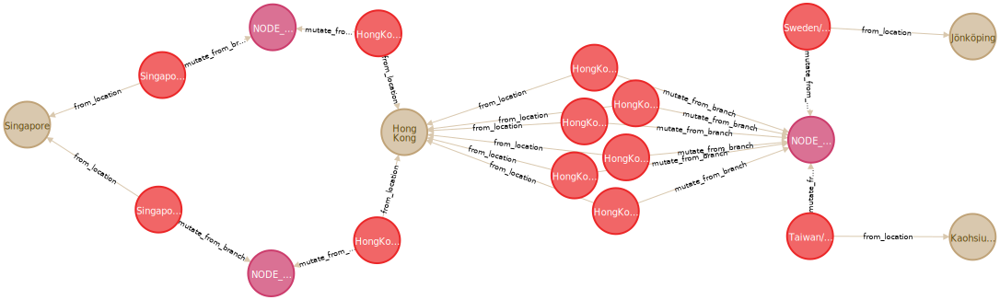
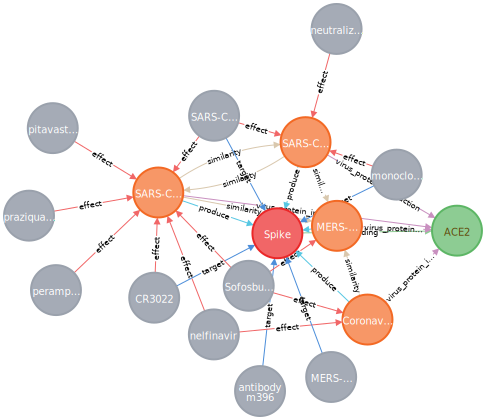
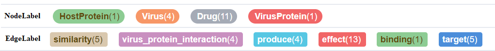
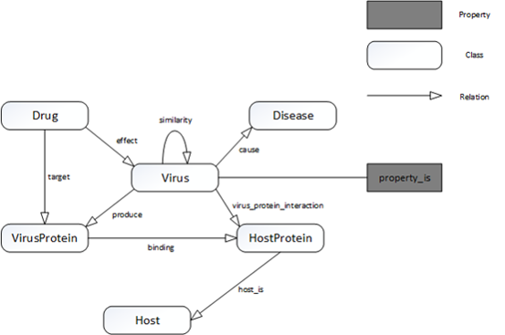

# Datasets for Covid-19 Knowledge Graph
This repository contains codes and datasets for Covid-19 Knowledge Graph, which can be integrated from different data sources and domains.
## Neo4j Datasets
The datasets are maintaiend by groups like neo4j. The datasets are mainly from publications and case statistics. 
* [url](http://www.odbms.org/2020/03/we-build-a-knowledge-graph-on-covid-19/)
* [detailed describtion](https://covidgraph.org)
* pros: easy to access.
* cons: currently only gene and publication related information are available.

#### scheme

  

The publication dataset and the gene dataset (marked in green) are linked by a "MENTIONS" link (marked in pink), which means the corresponding paper abstract mentions the gene symbol.

#### examples

* The subgraphs around the gene "CD191|CKR-1|CKR1|CMKBR1|HM145|MIP1aR|SCYAR1".

  

  

* The subgraphs around the authors in Hong Kong.

  

  

* The subgraphs of the case statistics around Hong Kong.

  

  

## OpenKG Datasets
The datasets are maintained by several universities and companies from mainland, e.g., Tsinghua University and Huawei. The datsets are from different areas, and the datasets for research purposes include information about host, virus, drugs, gene and protein.
* [url](http://www.openkg.cn/dataset/covid-19-research)
* [detailed describtion](https://mp.weixin.qq.com/s/eHbkrMtYpg-oEmWS92970w)
* pros: wide coverage with rich knowledge
* cons: need coding effords from original data sources in JSON.

#### schemes

  

#### examples

* yellow: city, red: strain, pink: strain branch

  

* yellow: virus (covid-19), red: protein, blue: host

  

* yellow: virus (sars), red: protein, blue: host

  

* yellow: virus (covid-19), red: protein, grey: gene

  

## Virus-Protein-Drug network
The datasets are released in the science paper published in Cell Discovery 2020. In the human PPI network, they analyzed human proteins that functionally associate with Covid-19 viral infection and proteins that serve as drug targets. 
* [url](https://github.com/ChengF-Lab/2019-nCoV)
* [describtion](https://www.nature.com/articles/s41421-020-0153-3.pdf)
* pros: proved data for potential drug discovery.
* cons: result onbly; domain knowledge needed to integrate the data.

#### examples

* The subgraphs around the HostProtein "ACE2" which is functionally associate with Covid-19 viral infection.

  

  

  

|Coronavirus | Host-Protein | Host-Gene-ID | PubMed-ID|
| --- | --- | --- | --- |
|IBV | NONO | 4841 | 23637410|
|IBV | GSK3A | 2931 | 23637410|
|IBV | GSK3B | 2932 | 23637410|
|IBV | PABPC1 | 26986 | 23637410|
|IBV | PABPC4 | 8761 | 23637410|
|IBV | HNRNPA1 | 3178 | 23637410|
|IBV | HNRNPA2B1 | 3181 | 23637410|
|IBV | NPM1 | 4869 | 23637410|
|IBV | G3BP1 | 10146 | 23637410|
|IBV | G3BP2 | 9908 | 23637410|
|IBV | RPL19 | 6143 | 23637410|
|IBV | PARP1 | 142 | 23637410|
|IBV | NCL | 4691 | 23637410|
|IBV | DDX1 | 1653 | 23637410|
|SARS | RYBP | 23429 | 22046132|
|SARS | PPIA | 5478 | 22046132|
|SARS | NOMO3 | 408050 | 22046132|
|SARS | FKBP1A | 2280 | 22046132|
|SARS | PPIG | 9360 | 22046132|
|SARS | MARK3 | 4140 | 22046132|
|SARS | PPIH | 10465 | 22046132|
|SARS | RCAN3 | 11123 | 22046132|
|SARS | HGS | 9146 | 22046132|
|SARS | BAG6 | 7917 | 22046132|
|SARS | DDAH2 | 23564 | 22046132|
|SARS | CAMLG | 819 | 22046132|
|SARS | CHMP2B | 25978 | 22046132|
|SARS | SNAP47 | 116841 | 22046132|
|SARS | MKRN2 | 23609 | 22046132|
|SARS | TPSAB1 | 7177 | 22046132|
|SARS | SERPING1 | 710 | 22046132|
|SARS | MKRN3 | 7681 | 22046132|
|SARS | PSMA2 | 5683 | 22046132|
|SARS | ABHD17A | 81926 | 22046132|
|SARS | PFDN5 | 5204 | 22046132|
|SARS | MIF4GD | 57409 | 22046132|
|SARS | NDUFA10 | 4705 | 22046132|
|SARS | VKORC1 | 79001 | 22046132|
|SARS | LAS1L | 81887 | 22046132|
|SARS | H2AFY2 | 55506 | 22046132|
|SARS | RPS20 | 6224 | 22046132|
|SARS | CHEK2 | 11200 | 22046132|
|SARS | TERF1 | 7013 | 22046132|
|SARS | DCTN2 | 10540 | 22046132|
|SARS | DDX5 | 1655 | 22046132|
|SARS | C11orf74 | 119710 | 22046132|
|SARS | EIF3F | 8665 | 22046132|
|SARS | EEF1A1 | 1915 | 22046132|
|SARS | CAV1 | 857 | 22046132|
|SARS | IKBKB | 3551 | 22046132|
|SARS | UBE2I | 7329 | 22046132|
|SARS | SGTA | 6449 | 22046132|
|SARS | ATP6V1G1 | 9550 | 22046132|
|SARS | BTF3 | 689 | 22046132|
|SARS | ATF5 | 22809 | 22046132|
|SARS | ND4L | 4539 | 22046132|
|SARS | COX2 | 4513 | 22046132|
|SARS | HNRNPA1 | 3178 | 22046132|
|SARS | ACE2 | 59272 | 22046132|
|SARS | CLEC4G | 339390 | 22046132|
|SARS | CD209 | 30835 | 22046132|
|SARS | CLEC4M | 10332 | 22046132|
|SARS | IRF3 | 3661 | 22046132|
|SARS | KPNA2 | 3838 | 22046132|
|SARS | SFTPD | 6441 | 22046132|
|SARS | PPIA | 5478 | 22046132|
|SARS | BCL2L1 | 598 | 22046132|
|SARS | BCL2L2 | 599 | 22046132|
|SARS | MCL1 | 4170 | 22046132|
|SARS | BCL2A1 | 597 | 22046132|
|SARS | BCL2 | 596 | 22046132|
|MERS | SKP2 | 6502 | 31852899|
|MERS | KPNA4 | 3840 | 29370303|
|MERS | PRKRA | 8575 | 24522921|
|MERS | CD9 | 928 | 28759649|
|MERS | TMPRSS2 | 7113 | 28759649|
|SARS | IKBKB | 3551 | 17705188|
|HCoV-229E | ANPEP | 290 | 28643204|
|HCoV-NL63 | ACE2 | 59272 | 28643204|
|IBV | ZCRB1 | 85437 | 28643204|
|MERS | DPP4 | 1803 | 28643204|
|MHV | HNRNPA1 | 3178 | 28643204|
|MHV | SYNCRIP | 10492 | 28643204|
|MHV | PTBP1 | 5725 | 28643204|
|MHV | CEACAM1 | 634 | 28643204|
|SARS | ZCRB1 | 85437 | 28643204|
|SARS | ACE2 | 59272 | 28643204|
|IBV | ANXA2 | 302 | 28643204|
|MHV | HNRNPA2B1 | 3181 | 28643204|
|MHV | HNRNPA3 | 220988 | 28643204|
|MHV | ACO2 | 50 | 28643204|
|MHV | DNAJB1 | 3337 | 28643204|
|MHV | HSPD1 | 3329 | 28643204|
|MHV | HSPA9 | 3313 | 28643204|
|MHV | COPB2 | 9276 | 30632963|
|MHV | RPL13A | 23521 | 30632963|
|MHV | EIF3E | 3646 | 30632963|
|MHV | EIF3I | 8668 | 30632963|
|MHV | NMT1 | 4836 | 30632963|
|MHV | CHMP4B | 128866 | 30632963|
|MHV | EIF3F | 8665 | 30632963|
|MHV | GBF1 | 8729 | 30632963|
|MHV | RRM2 | 6241 | 30632963|
|MHV | KIF11 | 3832 | 30632963|
|MHV | PSMD1 | 5707 | 30632963|
|MHV | SRP54 | 6729 | 30632963|
|MHV | NUDCD1 | 84955 | 30632963|
|MHV | NACA | 4666 | 30632963|
|MHV | SNX9 | 51429 | 30632963|
|MHV | BTF3 | 689 | 30632963|
|MHV | SCFD1 | 23256 | 30632963|
|MHV | PSMC2 | 5701 | 30632963|
|MHV | TFEB | 7942 | 30632963|
|MHV | TWF2 | 11344 | 30632963|
|MHV | YKT6 | 10652 | 30632963|
|MHV | KPNB1 | 3837 | 30632963|
|MHV | STX5 | 6811 | 30632963|
|MHV | STAT5A | 6776 | 30632963|
|MHV | RSL24D1 | 51187 | 30632963|
|MHV | ACBD5 | 91452 | 30632963|
|SARS | PHB | 5245 | STRING | Viruses|
|SARS | JUN | 3725 | STRING | Viruses|
|SARS | STAT3 | 6774 | STRING | Viruses|
|SARS | PPP1CA | 5499 | STRING | Viruses|
|SARS | SPECC1 | 92521 | STRING | Viruses|
|SARS | FGL2 | 10875 | STRING | Viruses|
|SARS | XPO1 | 7514 | STRING | Viruses|
|HCoV-229E | TGFB1 | 7040 | STRING | Viruses|
|HCoV-229E | FGL2 | 10875 | STRING | Viruses|
|MHV | SMAD3 | 4088 | STRING | Viruses|
